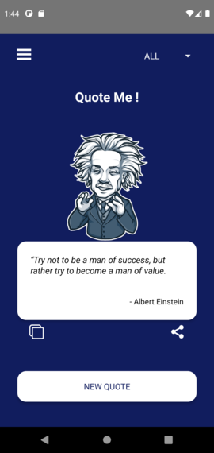
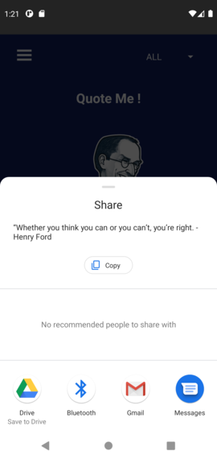
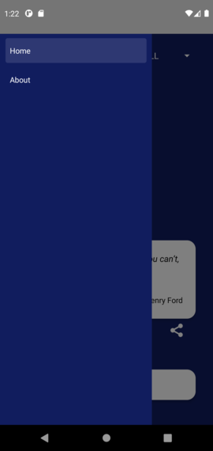

# Quote ME

> Random Quote generator Mobil App.

As my first introduction to React-Native I present to you my first app;
A simple and fun react-native based, android mobile application, Generate famous personality quotes, copy them, and easily share them with your friends on social media!.

All personages images set can be found here:
(<https://telegram.org/blog/stickers-meet-art-and-history>)
(<https://telegram.org/blog/moar-stickers>)

  

## Contributing

1. Fork it (<https://github.com/Ghali-Benbernou/Quotes-App/fork>)
2. Create your feature branch (`git checkout -b feature/Swag`)
3. Commit your changes (`git commit -am 'Add some Swag'`)
4. Push to the branch (`git push origin feature/Swag`)
5. Create a new Pull Request
